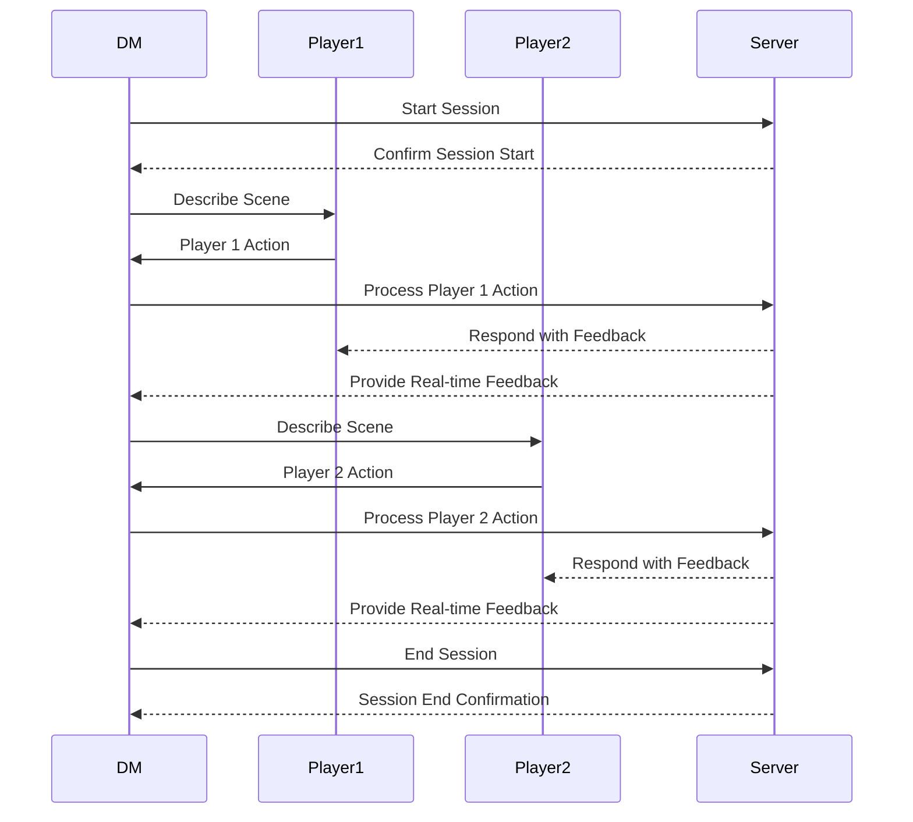

# DM Training Grounds

## Elevator Pitch
Soon welcoming the newest [WorldSmith.io](https://www.worldsmith.io/) feature: The Dungeon Master Training Grounds! Already, we use AI to help DMs prepare their campaigns and sessions. However, what if you are a new DM? What if you want to learn how to run your own sessions with ease and wow your players? The WorldSmith Training Grounds is the perfect tool to help you get started and prepare for your first session. It features an AI-powered chatbot that simulates real player interactions, allowing you to practice handling different player dynamics in a controlled environment. Additionally, the learning module includes interactive lessons and quizzes on core game mechanics, helping new DMs build confidence, track their progress, and improve their skills before stepping into live gameplay.

## Design
Here are some initial sketches for the **DM Training Grounds** interface:

### DM Training Hub

*Main dashboard for users to access learning modules, quizzes, and the chatbot.*

### ChatBot Interface

*Interface where DMs interact with AI-powered players.*

### Quiz/Learning Module

*Interactive lessons and quizzes for new Dungeon Masters.*

### Login Page

*Simple login page where DMs create an account or log in.*

### Dropdown

*Dropdown feature for selecting scenarios or player configurations.*

### Chatbot Interaction Flow

*Mermaid diagram illustrating the flow of interaction between the Dungeon Master, players, and the server during a training session.*

## Key Features
- **Learning Modules**: Structured lessons covering key D&D mechanics. Each module is interactive, guiding new DMs through different topics and challenges they may encounter in real sessions.
- **Quizzes and Scoring**: After completing each module, users will take quizzes to assess their understanding. Scores are tracked and displayed next to completed modules in the user’s profile.
- **AI-Powered Chatbot**: Simulates realistic player interactions, allowing DMs to practice handling multiple players in a controlled environment.
- **Player Configuration**: Customize player attributes like class and level to simulate different types of players.
- **Scenario Selection**: Choose from pre-made scenarios or load custom ones to test your ability to adapt to various in-game situations.
- **Interactive Gameplay**: Users manage player actions, rolls, and the story in real-time. Practice your role as a DM in realistic gameplay scenarios.
- **Real-Time Feedback**: DMs will receive instant feedback and scoring after each session, helping them improve their game management skills.
- **Progress Tracking**: Users can view their quiz results, completed lessons, and chatbot performance in their profile, making it easy to see their progress.

## Technologies
I will use the required technologies in the following ways:

- **HTML**: The app will utilize standard HTML for organizing content, including sections for the DM Training Hub, Learning Modules, and Chatbot Interface.
- **CSS**: CSS will be used to create responsive designs and ensure the app looks great across devices. There will be animations for smoother transitions between sections like lessons, quizzes, and gameplay sessions.
- **React**: React will serve as the framework for building a single-page application (SPA). It will manage dynamic content updates in the chatbot interface, learning modules, and user profile.
- **JavaScript**: JavaScript will handle user interactions, such as quiz submissions, scoring, and the dynamic chatbot. It will manage real-time responses from the chatbot and updates to the user's progress.
- **Web Services**:
  - **Own Service**: The backend APIs will manage game scenarios, user progress, and real-time chatbot interactions.
  - **Third-Party Services**:
    - **ChatGPT/Claude**: API calls will be made to ChatGPT or Claude to simulate player interactions during the chatbot sessions.
    - **D&D 5e API**: The [D&D 5e API](https://www.dnd5eapi.co/) will be used to fetch data like spells, monsters, and other in-game details to enhance the gameplay experience.
- **Authentication**: The app will use a custom authentication system built with Express and MongoDB. Users will log in using an email and password. JWT tokens will manage session authentication and be stored securely in cookies.
- **Database**: MongoDB will store user data, including quiz scores, lesson progress, and chatbot performance. Predefined quiz questions will also be stored in MongoDB and pulled randomly for each quiz.
- **WebSockets**: WebSockets will manage real-time interactions between the DM and simulated players during the chatbot sessions.
